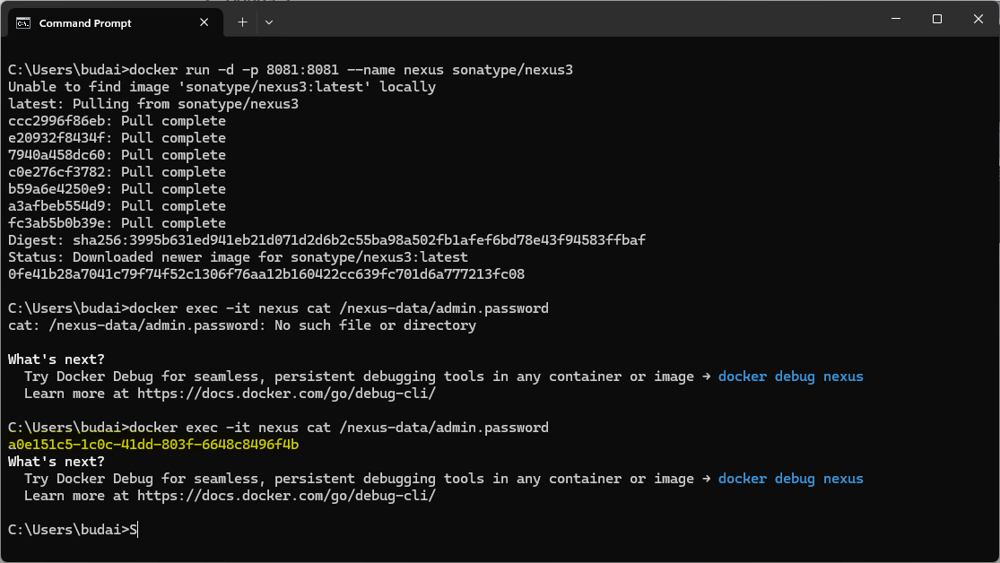
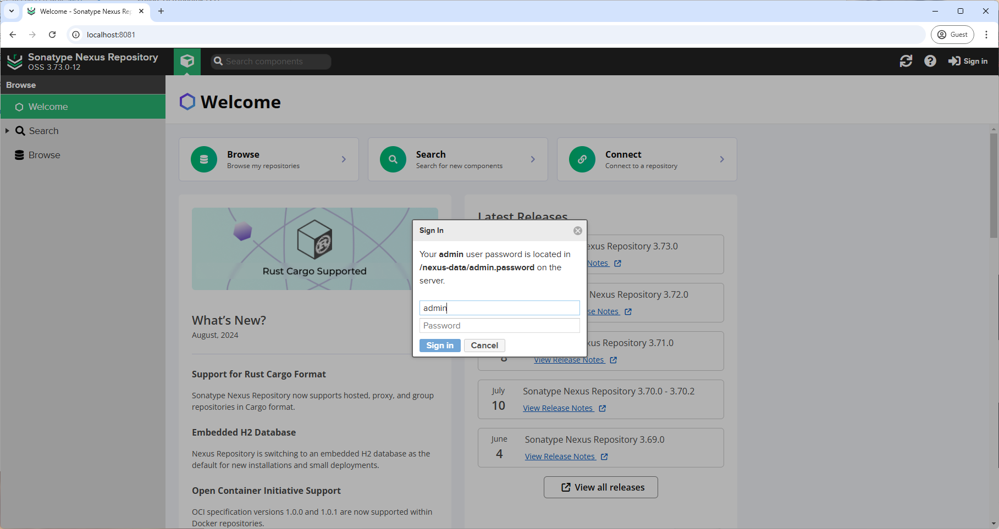
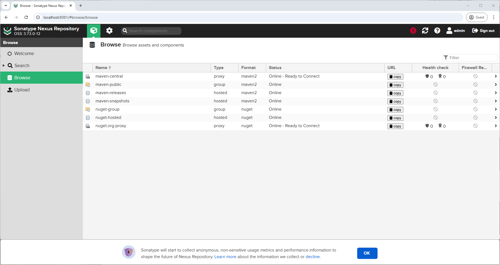
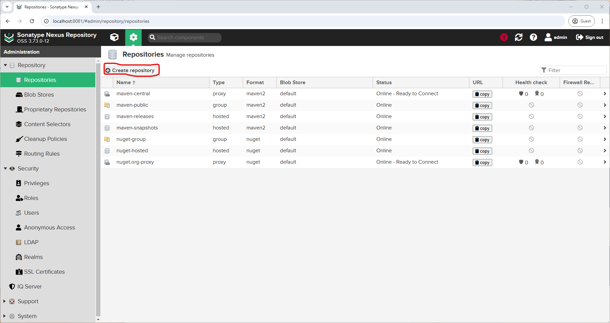
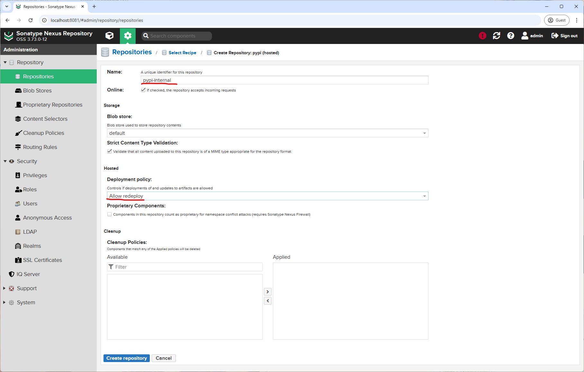
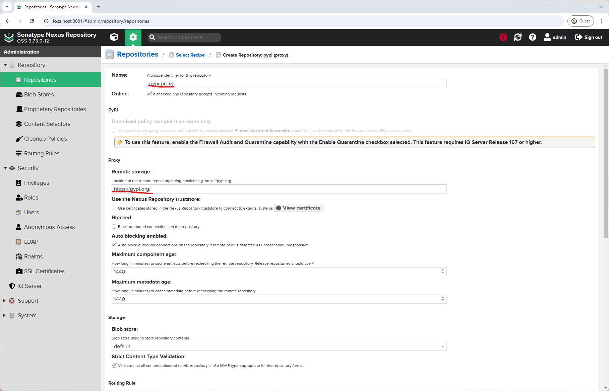
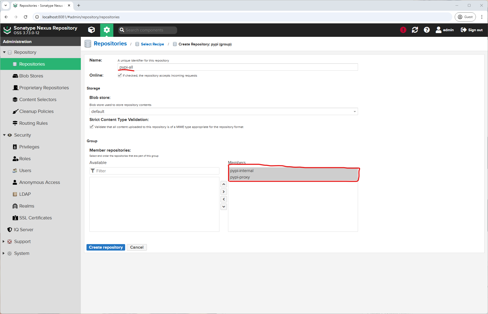
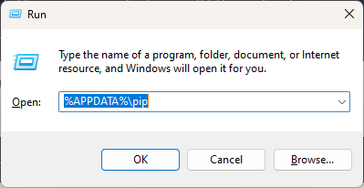
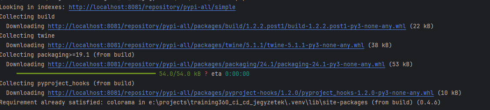
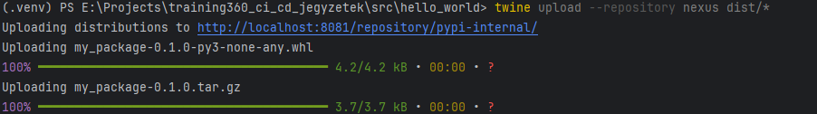

# Nexus Repository Manager Guide

## Table of Contents
- [Introduction](#introduction)
- [Installation](#installation)
- [Repository Types](#repository-types)
- [PyPI Repository Setup](#pypi-repository-setup)
- [Working with Python Packages](#working-with-python-packages)
- [Docker Repository Setup](#docker-repository-setup)
- [Best Practices](#best-practices)
- [Q&A](#qa)

## Introduction

Nexus Repository Manager is an artifact repository manager that supports multiple repository formats including Maven, npm, PyPI, and Docker. This guide focuses on setting up and using Nexus for Python packages and Docker images.

## Installation

### Running Nexus with Docker

```bash
# Start Nexus container
docker run --name nexus -d -p 8091:8081 -p 8092:8082 sonatype/nexus3

docker log -f nexus
```

```bash

# Get initial admin password
docker exec -it nexus cat /nexus-data/admin.password
```

show image here


Access the web interface at http://localhost:8091

- Default username: admin
- Default password: found in the file above

## Repository Types

Nexus supports three types of repositories:

1. **Hosted Repository**
   - Private storage for your artifacts
   - Full control over what's stored
   - Example: storing company-internal packages

2. **Proxy Repository**
   - Caches artifacts from remote repositories
   - Provides faster access to external artifacts
   - Reduces bandwidth usage
   - Works as a proxy to PyPI or Docker Hub

3. **Group Repository**
   - Combines multiple repositories
   - Provides a single URL for all repositories
   - Defines search order through member ordering



## PyPI Repository Setup

### Creating Repositories
```Settings → Repositories → Create repository```



1. **Create Hosted Repository (pypi-internal)**
```
Settings → Repositories → Create repository
- Recipe: pypi (hosted)
- Name: pypi-internal
- Deployment policy: Allow redeploy
```



2. **Create Proxy Repository (pypi-proxy)**
```
Create repository
- Recipe: pypi (proxy)
- Name: pypi-proxy
- Remote storage: https://pypi.org/
```



3. **Create Group Repository (pypi-all)**
```
Create repository
- Recipe: pypi (group)
- Name: pypi-all
- Members: pypi-internal, pypi-proxy
```



### Configuration Files

1. **pip configuration** (`~/.pip/pip.conf` or `%APPDATA%\pip\pip.ini`):

On windows try Windows + R and type `%APPDATA%`. If the folder `pip` does not exist, create it and add the `pip.ini` file.


```ini
[global]
index-url = http://localhost:8081/repository/pypi-all/simple
trusted-host = localhost
```

2. **.pypirc configuration** (`~/.pypirc`):

On windows try Windows + R and type `%USERPROFILE%`. If the file `.pypirc` does not exist, create it and add the following content.

```ini
[distutils]
index-servers =
    nexus

[nexus]
repository = http://localhost:8081/repository/pypi-internal/
username = admin
password = your_password
```

## Working with Python Packages

### Package Structure
```
my-package/
├── setup.py
├── src/
│   └── mypackage/
│       ├── __init__.py
│       └── main.py
```

### setup.py Example
```python
from setuptools import setup, find_packages

setup(
    name="my-package",
    version="0.1.0",
    packages=find_packages(where="src"),
    package_dir={"": "src"},
    install_requires=[
        "requests>=2.25.1",
    ],
    entry_points={
        'console_scripts': [
            'my-command=mypackage.main:main',
        ],
    },
)
```

### Building and Publishing
```bash
# Install build tools
pip install build twine

# Build package
python -m build

# Upload to Nexus
twine upload --repository nexus dist/*
```





## Docker Repository Setup

### Creating Docker Repository
```
Settings → Repositories → Create repository
- Recipe: docker (hosted)
- Name: docker-internal
- HTTP port: 8082
- Enable Docker v1 API
```

### Docker Daemon Configuration
Edit `/etc/docker/daemon.json`:
```json
{
  "insecure-registries": ["localhost:8082"]
}
```

Restart Docker:
```bash
sudo systemctl restart docker
```

### Working with Docker Images
```bash
# Login to Nexus Docker registry
docker login localhost:8082

# Tag image
docker tag nginx:latest localhost:8082/nginx:latest

# Push image
docker push localhost:8082/nginx:latest

# Pull image
docker pull localhost:8082/nginx:latest
```

## Best Practices

### Security
- Change default admin password immediately
- Use HTTPS in production
- Implement role-based access control
- Regular security updates

### Maintenance
- Monitor disk space
- Set up cleanup policies
- Regular backups
- Health monitoring

### CI/CD Integration
Example GitLab CI configuration:
```yaml
publish_package:
  stage: publish
  script:
    - pip install build twine
    - python -m build
    - twine upload --repository nexus dist/*
  only:
    - tags
```

## Q&A

### Q: Why do we need three different repositories?
**A:** The three repositories serve different purposes:
- **Hosted (pypi-internal)**: Stores your private packages
- **Proxy (pypi-proxy)**: Caches packages from PyPI, saving bandwidth and providing faster access
- **Group (pypi-all)**: Combines both repositories, providing a single URL for pip to use

### Q: Why do I need both pip.conf and .pypirc?
**A:** They serve different purposes:
- **pip.conf**: Configures where pip downloads packages from
- **.pypirc**: Configures where twine uploads packages to

### Q: What is the role of twine and what commands are available?
**A:** Twine is a tool for publishing Python packages. Key commands:
```bash
twine check dist/*          # Validate package
twine upload dist/*         # Upload package
twine upload --dry-run      # Test upload without publishing
```
Twine is preferred over `setup.py upload` because it:
- Uses HTTPS by default
- Provides better security
- Verifies package integrity

### Q: What does the Docker repository store and why don't I see any images?
**A:** Docker repository stores:
- Docker images
- Image layers
- Image metadata

If you don't see images, you need to:
1. Tag images for your repository
2. Login to your Nexus Docker registry
3. Push images to the repository

Example workflow:
```bash
docker tag nginx:latest localhost:8082/nginx:latest
docker login localhost:8082
docker push localhost:8082/nginx:latest
```
