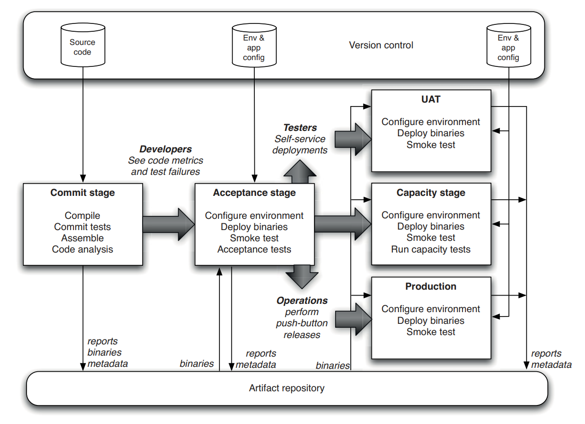
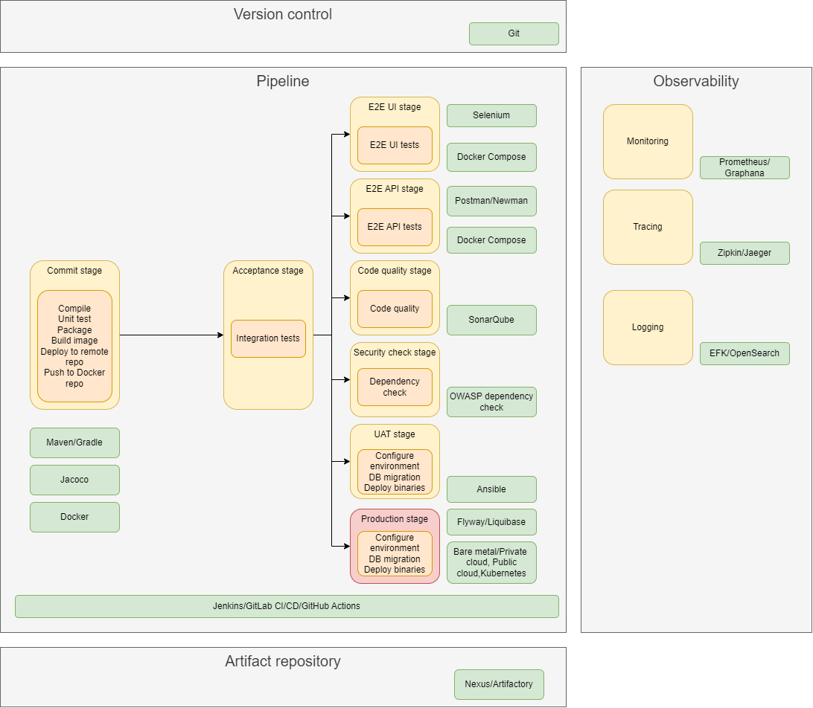

class: inverse, center, middle

# CI/CD implementálása Python, Jenkins/GitLab és Docker/Kubernetes eszközökkel

---

class: inverse, center, middle

# DevOps

---

## Klasszikus   szállítási folyamat (release)

* Felhasználók igénybe tudják venni
* Lépései (módszertantól függetlenül)
  * Követelmény felmérés (funkcionális és nem-funkcionális - minőségi (quality attributes) követelmények)
  * Tervezés
  * Implementálás
  * Tesztelés
  * Telepítés
* Folyamatosan meg kell figyelni (observing)

---

## Megjelenhetnek 

* További követelmények
* Funkcionális hibák
* Performancia problémák

---

## Elvárások és problémák

* Gyors és magas minőségű (hiba nélküli) értékes szállítás
* Klasszikus problémák
  * Kommunikációs problémák a fejlesztők és az üzemeltetés között
  * Különböző célok: fejlesztés és stabilitás (gyakran bürökratikus eszközök, dokumentációk, checklistek)
  * Biztonsággal kapcsolatos elvárások
  * Tesztelés (pl. manuális tesztelés)
* Nagyon sok manuális munka: emberek gyengék ezek elvégzésében, számítógépek jók
  * Könnyű hibát véteni
  * Tudásmegosztás bonyolult (wiki)
  * Átláthatatlan, auditálhatatlan
  * Ismételhetetlen

---

## DevOps

* Gondolkodásmód, gyakorlatok, eszközök összessége
* Gyors és magas minőségű szállításra
* Akár a napi többszöri szállítás elérése
* Kommunikáció, kollaboráció
* Automatizálás
* Átláthatóság
* Megvalósítása cégenként változik

---

## DevOps engineer

* Gyakori DevOps minta
* Szerepkör
* Sokan ellenzik a létjogosultságát
* Feladata: szállítási folyamat megalkotása

---

class: inverse, center, middle

# Continuous Delivery

---

## Continuous Delivery

* A DevOps központi eleme
* Elvek és gyakorlatok összessége
* Értékes és robosztus szoftver kiadására
* Rövid ciklusokban
* Funkcionalitás apró darabokban kerül hozzáadásra
* Bármelyik pillanatban (potenciálisan) szállítható
  * Amiről az üzlet dönthet
* Alapja: Jez Humble, Dave Farley: Continuous Delivery (Addison-Wesley, 2010)
* Technológiai és szervezeti vonatkozásai
* Daniel Bryant, Abraham Marín-Pérez: Continuous Delivery in Java (O'Reilly, 2018)

---

## Pipeline

* Eszköze az automatizált, ismételhető, megbízható build pipeline
  mely a változtatás szállítását végzi
* Tipikus feladatok
	* Fordítás
  * Unit tesztek
	* Csomagolás (package), manapság gyakran konténer image-be
	* Publikálás (repo-kba - deploy)
  * Tesztelés: automata és manuális
    * Statikus kódellenőrzés/tesztelés
    * Funkcionális tesztek, lsd. teszt piramis (unit, integrációs, end-to-end), tesztlefedettség, stb.
    * Nem-funkcionális követelmények tesztelése (teljesítmény és biztonsági tesztek)
	* Telepítés különböző környezetekbe, beleértve az adatbázis migrációkat is (deploy)

---

## Gyors visszajelzések előnyei

* Gyors visszajelzés
	* Üzleti oldalról
	* Technológiai oldalról
* Minél koraibb visszacsatolás, annál kisebb a hibajavítás költsége
* Hibajavításkor nem nagyon régi kódhoz kell visszanyúlni
* Csökken a context switch költsége

---

## Ellenpélda

* Megbízhatatlan, körülményes, manuális telepítési folyamat
* Kiadás elodázása
* Big bang release
* Lassú visszajelzés

---

## Metrikák

* Milyen gyakran történik szállítás?
* Mennyi idő alatt kerül ki egy módosítás az élesbe?
* Mennyi a sikertelen kiadások aránya?
* Hiba esetén általában mennyi a helyreállítás ideje?

[DevOps Research and Assessment](https://dora.dev/)

---

## Continuous Integration

* Elkészült kód naponta többszöri integrálása
* Verziókövető rendszerbe való feltöltés, fordítás, 
  esetleg a tesztesetek futtatása
* A CD ennél több, ugyanis az pluszként elvárja, hogy az alkalmazás
  bármikor szállítható
* CI/CD nehezen értelmezhető, de széleskörben elterjedt

---

## Continuous Deployment

* Ha a módosítás után végigfut a pipeline, beleértve az automata teszteket is, akkor
  szállítható, azaz azonnal igénybe vehetik a felhasználók

Forrás: [Atlassian: Continuous integration vs. delivery vs. deployment](https://www.atlassian.com/continuous-delivery/principles/continuous-integration-vs-delivery-vs-deployment)

---

class: inverse, center, middle

# Pipeline és legjobb gyakorlatok

---

## Pipeline

Forrás: [Jez Humble: Deployment pipeline anti-patterns](https://continuousdelivery.com/2010/09/deployment-pipeline-anti-patterns/)

---

## Basic pipeline

Forrás: Jez Humble, Dave Farley: Continuous Delivery (Addison-Wesley, 2010)

---

## Egy artifact megy végig

* Egy artifact megy végig: _single source of truth_
  * Amennyiben más megy ki teszt és éles környezetbe, lehet, hogy a hiba csak az egyik környezetben fog megjelenni
  * Így szoktak hivatkozni a verziókövető rendszerre is

---

## Azonos környezetek és telepítés

* Works on my machine eliminálása
* Környezetek közötti különbségek minimalizálása
* Tesztelve lesznek a telepítő szkriptek
* A konfiguráció a környezet és nem az alkalmazás része

---

## Smoke teszt a különböző   környezeteken

* Elindult-e az alkalmazás az adott környezeten
* Elérhetőek-e a függőségei, pl. adatbázis, message broker, stb.

---

## Minden változtatás indítsa   a pipeline-t

* Csak így deríthető melyik változtatás okozta a hibát

---

## Hiba a pipeline-ban

* Ha az egyik stage hibára fut, akkor álljon meg a pipeline

---

class: inverse, center, middle

# Konkrét pipeline és eszközök

---

## Legjobb gyakorlat

* Érdemes a pipeline stage-eit egyesével, iteratív módon fejleszteni
* Egy stage a CD eszköztől leválasztva is külön futtatható legyen
  * Könnyebb fejlesztés és tesztelés
  * Platformfüggetlenség

---

## Konkrét pipeline és eszközök

---

class: inverse, center, middle

# Build eszközök

---

## Build eszközök feladata

* Eszköz, mely képes automatizálni a következő feladatokat
  * Függőségek kezelése, letöltés repo-ból
  * Fordítás
  * Csomagolás
  * Tesztek futtatása, tesztlefedettség gyűjtése
  * Csomag deploy repo-ba
  * Egyedi automatizálandó feladatok elvégzése, mint pl. kódgenerálás, dokumentáció generálás, függőségek biztonsági ellenőrzése, stb.