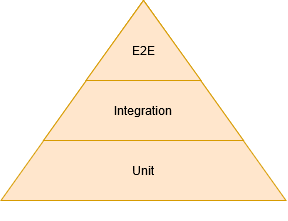

# Tesztelési módszerek

---

## Tesztpiramis



* Unit tesztek: adott programozási nyelv legkisebb részeit tesztelik (nincs adatbázis)
* Integrációs tesztek: csoportba szervezett egységek tesztelése, nem nyúlik át másik rendszerekbe (lehet adatbázis)
* E2E: szoftverrendszer tesztelése adott környezetben, külső függőségeivel integrálva, funkciók, folyamatok tesztelése az elejétől a végéig

---

class: inverse, center, middle

# Test-Driven Development (TDD)

---

## Mi az a TDD?

* Szoftverfejlesztési megközelítés
* A tesztek írása **megelőzi** a kód írását
* Rövid fejlesztési ciklusok
* Folyamatos tesztelés és refactoring
* "Red-Green-Refactor" ciklus

---

## TDD ciklus


1. **Red**: Írj egy elbukó tesztet
2. **Green**: Implementáld a minimális kódot ami javitja a tesztet
3. **Refactor**: Tisztítsd és javítsd a kódot

---

## TDD példa Pythonban

1️⃣ Először a teszt:

```python
def test_calculate_price():
    calculator = PriceCalculator()
    assert calculator.calculate(100, "GOLD") == 90  # 10% kedvezmény
```

2️⃣ Majd a minimális implementáció:

```python
class PriceCalculator:
    def calculate(self, price, membership):
        if membership == "GOLD":
            return price * 0.9
```

3️⃣ Végül refaktorálás és további tesztek

---

## TDD előnyei

* Tisztább, tesztelhető kód
* Jobb kód design
* Kevesebb bug
* Azonnali visszajelzés
* Élő dokumentáció
* Magabiztosabb refaktoring

---

## TDD best practices

* Kis lépésekben haladjunk
* Egy teszt = egy funkcionalitás
* FIRST alapelvek:
  * **F**ast (Gyors)
  * **I**solated (Izolált)
  * **R**epeatable (Ismételhető)
  * **S**elf-validating (Önellenőrző)
  * **T**imely (Időszerű)

---

## TDD Code Kata példa

Starting with a test:

```python
def test_string_calculator():
    calc = StringCalculator()
    assert calc.add("") == 0  # Üres string esetén
    assert calc.add("1") == 1  # Egy szám esetén
    assert calc.add("1,2") == 3  # Két szám esetén
```

Implementation:

```python
class StringCalculator:
    def add(self, numbers):
        if not numbers:
            return 0
        nums = numbers.split(',')
        return sum(int(n) for n in nums)
```

---

## TDD hibák és elkerülésük

❌ Gyakori hibák:
* Túl nagy lépések
* Hiányzó refaktoring
* Túl sok funkcionalitás egyszerre

✅ Megoldások:
* Baby steps módszer
* Rendszeres refaktoring
* Single Responsibility elv követése
* Folyamatos code review

---


class: inverse, center, middle

# Integrációs tesztek

---

## Integrációs tesztek in-memory adatbázison

* H2 adatbázis, Javaban implementált, alkalmazással egy JVM-ben
* Nagyon gyors
* Kb. 2,5 MB méretű jar fájl
* Szabvány SQL támogatás
* Kompatibilitási módok: IBM DB2, Apache Derby, HSQLDB, MS SQL Server, MySQL, Oracle, PostgreSQL

---

## Integrációs tesztek <br /> valós adatbázison

* Létező infrastruktúrán
* Build tool indítsa el integrációs tesztek futtatása előtt, akár konténerizálva
* [Testcontainers](https://www.testcontainers.org/)
* Minden esetben konfigurálhatóvá kell tenni a kapcsolódási paramétereket
  * Pl. parancssori paraméter vagy környezeti változó

---

## Tesztelési alapfogalmak

* **Bug Detection**: Hibák korai felderítése a fejlesztési folyamatban
* **Regression Prevention**: Meglévő funkcionalitás megőrzése
* **Documentation**: Tesztek mint dokumentáció
* **Refactoring Support**: Biztonságos kód átszervezés

---

## Python tesztelési keretrendszerek

* **Pytest**
  * Egyszerű szintaxis
  * Hatékony assertek
  * Automatikus teszt felfedezés
  * Fixture támogatás
  * Párhuzamos futtatás

* **Unittest**
  * Beépített Python modul
  * xUnit stílusú tesztelés
  * Teszt discovery
  * TestCase alapú szervezés

---

## Példa: Unit teszt Pytest-tel

```python
# test_math.py
def add_numbers(a, b):
    return a + b

def test_add_numbers():
    result = add_numbers(2, 3)
    assert result == 5

    result = add_numbers(-1, 1)
    assert result == 0
```

---

## Tesztelési típusok

* **Unit tesztek**: Komponensek izolált tesztelése
* **Integrációs tesztek**: Komponensek együttműködésének tesztelése
* **Funkcionális tesztek**: Teljes rendszer működésének ellenőrzése
* **Teljesítmény tesztek**: Sebesség és stabilitás vizsgálata
* **Biztonsági tesztek**: Sérülékenységek ellenőrzése

---

## Tesztírási követelmények

* **Moduláris tervezés**: Kis, újrafelhasználható függvények/osztályok
* **Izoláció**: Független funkciók, jól definiált be/kimenettel
* **Tesztelhető logika**: Komplex logika lebontása kisebb egységekre
* **Minimális mellékhatások**: Globális állapot módosítások kerülése

---

## Happy Path vs Sad Path

```python
# Happy Path példa
def test_divide():
    result = divide(6, 2)
    assert result == 3.0

# Sad Path példa
def test_divide_by_zero():
    with pytest.raises(ZeroDivisionError):
        divide(10, 0)
```

---

## Pytest speciális funkciók

* **Test skippping**: `@pytest.mark.skip`
* **Fixture használat**: Erőforrások kezelése
* **conftest.py**: Megosztott konfigurációk
* **Paraméteres tesztek**: Több bemenet tesztelése
* **Párhuzamos futtatás**: Gyorsabb végrehajtás