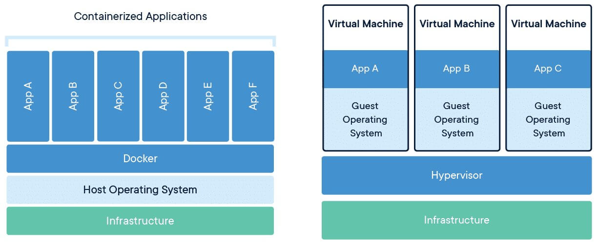

class: inverse, center, middle

# Csomagolás Docker Image-be Dockerfile használatával

---

## Konténerizáció

- Teljes alkalmazás szállítása környezetével együtt
- Analógia: konténer hajóban
- Artifact: image, futtatva: konténer

---

## Docker

- Operacios rendszer szintű virtualizáció
- Jól elkülöníthető környezetek, saját fájlrendszerrel és telepített alkalmazásokkal
- Jól meghatározott módon kommunikálnak egymással
- Kernelt nem tartalmaz, hanem a host Linux kernel izoláltan futtatja
  - Linux kernel cgroups és namespaces képességeire alapozva
- Kevésbé erőforrás igényes, gyorsabb, mint a VM 

---

## Docker



---

## Docker felhasználási területek

- Saját fejlesztési környezetben reprodukálható erőforrások
  - Adatbázis, cache, kapcsolódó rendszerek (kifejezetten microservices esetén)
- Jól használható CI/CD folyamatokban, automata teszeknél
- Portabilitás: ugyanaz az image futtatható lokálisan, teszt környezetben, prod környezetben

---

## Dockerhub

- Publikus szolgáltatás imagek megosztására

---

## Docker fogalmak


---


## Saját image összeállítása

* `docker build` parancs használatával
* `Dockerfile` alapján
* Kiindulási image
* Munkakönyvtár megadása
* Alkalmazás másolása
* Konténer indulásakor végrehajtott parancs

---

class: inverse, center, middle

# Docker layers

---

## Layers


---

## Legjobb gyakorlat

* Külön változó részeket külön layerbe tenni
* Operációs rendszer, JDK, libraries, alkalmazás saját fejlesztésű része külön <br /> layerbe kerüljön

---

## Dockerfile

* [Multi-stage build](https://docs.docker.com/develop/develop-images/multistage-build/)


---

## Layers ellenőrzése

`docker image inspect`


---

class: inverse, center, middle

# Deploy Docker image to Nexus

---

## Deploy Docker image to Nexus

* Create Docker hosted repository (port `8082`)
* Adminisztrációs felületen: _Nexus Security / Realms_ tabon: _Docker Bearer Token Realm_ hozzáadása

```shell
docker tag employees localhost:8092/employees
docker login localhost:8092
docker push localhost:8092/employees
```

---

class: inverse, center, middle