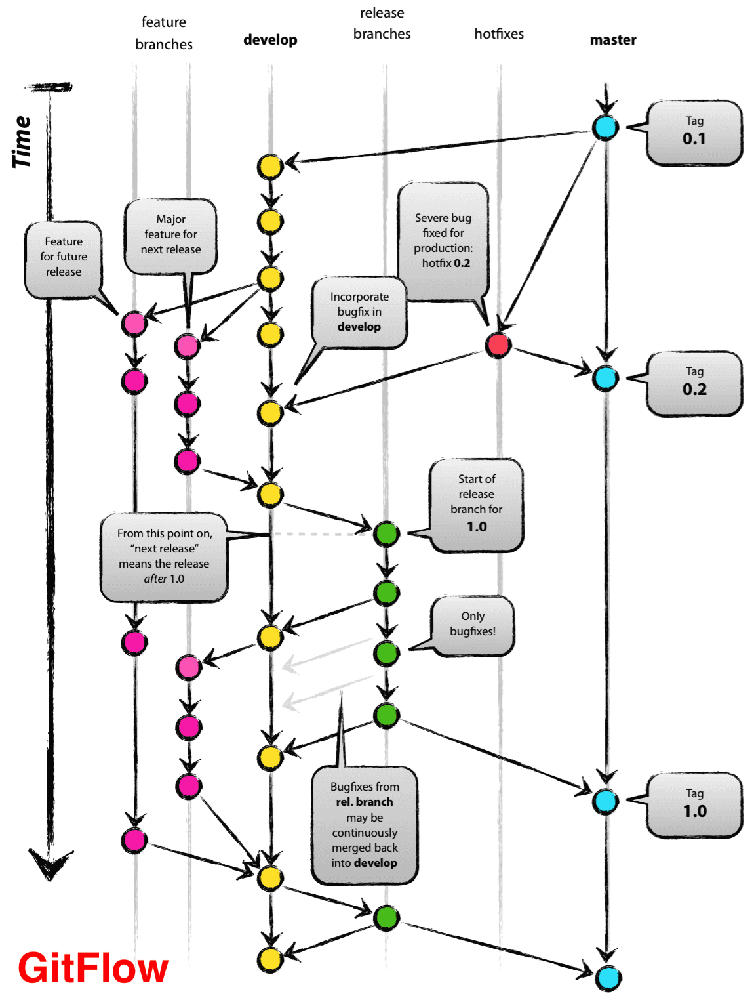
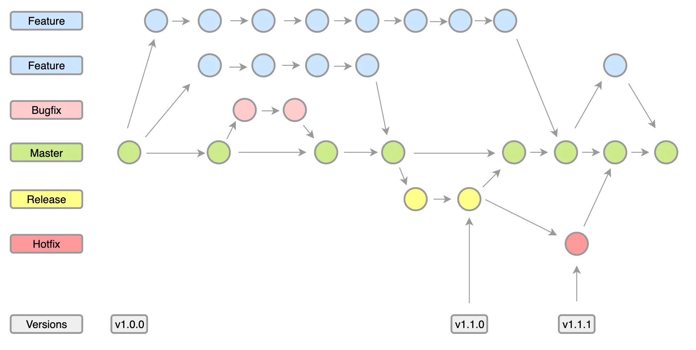

class: inverse, center, middle

# Verziókezelés és Trunk-Based Development

---

## Verziókezelés

* Forráskód, erőforrás állományok, tesztesetek, konfigurációk
* Single source of truth

---

## Monorepo vagy multiple   repositories

* Egyben látható, kezelhető
* Segíti a tudásmegosztást, kódújrafelhasználást,
átláthatóságot
* Egyszerűbb lehet a projekteken átívelő tesztek felépítése
* Egyszerűbb a projekteken átívelő módosítások kezelése
* Elrettentő lehet
* Túl nagy méret, feature branch
* Eszközök, pl. Maven nincs kellően felkészítve rá

---

## Trunk-Based Development   For Smaller Teams

* Egy branch, `main` (régebben `master`)
* Centralized workflow

Forrás: https://trunkbaseddevelopment.com/branch-for-release/

---

## Trunk-Based Development   tulajdonságok

* Kis méretű sztorik
* Feature flagek alkalmazása
* Elősegíti a csapatmunkát, bizalmat
* Nincs merge conflict
* Nagyon támaszkodni kell az automata tesztekre
* Javasolt:
  * Kis méretű csapatnál
  * CD szemponjából ez a preferált
  * Tapasztalt fejlesztők
  * Új funkciók gyors szállításánál

---

## Feature flag

* Kódban megmarad a régi és az új működés is
* Legegyszerűbb: új menüpont elrejtése, megjelenítése
* Elágazások a kódban, feltétel alapján
  * Szerepkör alapján
  * Black/white list
  * IP-cím alapján
* Deploy vs. release
  * Attól, hogy kikerül éles környezetbe, még nem biztos, hogy használatba veheti a felhasználó
  * Elválik a szereplő, hogy ki release-elheti ki
* Használható A/B tesztelésre is
* Gondoskodni kell a flagek kivezetéséről

---

class: inverse, center, middle

# Branch-elési stratégiák

---

## Trunk-Based Development @ Scale

* Feature branch workflow
* GitHub Flow

---

## Trunk-Based Development @ Scale tulajdonságok

* Jól beilleszthető a code review és continuous integration (merge request)
* Jól követhető, hogy ki min dolgozik
* Merge kevés kockázattal jár
* Javasolt:
  * Legreálisabb
  * Illeszkedik a CD-hez

---

## Forking

* Repo lemásolása, munka saját repo-ba
* Kis csapat felelős a projektért, de sok külsős fejlesztő
* Javasolt:
  * Főleg open-source projekteknél

---

## Release branching

* Release-enként egy branch, melyen történik is fejlesztés
* Itt már bejön a merge

---

## Git Flow

---

## Git Flow branch-ek

* Két fő branch: `main` (élesen lévő), `develop` (élesen lévő és azóta történt módosítások),
* Feature branches, elkészülte után vissza a `develop`-ra
* Release branches, `develop`-ról
* Hotfix branches

Forrás: https://www.flagship.io/git-branching-strategies/

---

## Git Flow tulajdonságok

* Független fejlesztés és szállítás
* Akár párhuzamosan több release-en is történhet a fejlesztés
* Nagyon gyakori lehet a merge conflict
* Régi branch-ek kezelése problémás lehet
* Spaghetti git history
* Nem támogatja a CD-t
* Sokan miért nem érzik problémásnak?
  * Nem ők végzik a merge-öt
* Egyik leggyakrabban használt
* Javasolt
  * Ha a fejlesztési ciklus release orientált
  * Nagyobb csapatoknál

---

## Environment branching

* Különböző környezekhez különböző branchek
* GitLab Flow

---

## OneFlow

* Egyszerűsít: összevonja a `main` és `develop` branch-et

Forrás: https://betterprogramming.pub/a-simple-git-repository-strategy-93a0c7450f23
