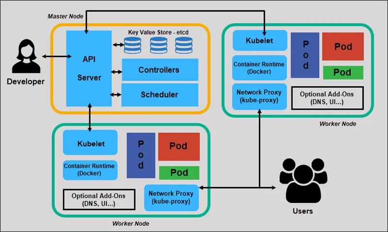

class: inverse, center, middle

# Kubernetes Alapok és Orchesztráció

---

class: inverse, center, middle

# Kubernetes Áttekintés

---

## Mi a Kubernetes?

* Konténer-orchesztrációs platform
* Google által fejlesztett, nyílt forráskódú
* Production-ready megoldás
* Legnagyobb konténer orchestration platform
* Cloud-native alkalmazások alapja

---

## Főbb előnyök

* Automatizált deployment és skálázás
* Öngyógyító képességek
* Load balancing beépítve
* Storage orchestration
* Batch végrehajtás támogatása
* Service discovery és terheléselosztás
* Deklaratív konfiguráció

---

## Architektúra áttekintés

* Master és node komponensek
  


---

class: inverse, center, middle

# Kubernetes Alapfogalmak

---

## Node koncepció

* Master és worker node-ok szerepe
* Node komponensek:
  * kubelet - node agent
  * kube-proxy - hálózati proxy
  * Container runtime (pl. Docker)
* Node státuszok és monitorozás
* Resource management

---

## Pod koncepció

* Legkisebb deployolható egység
* Egy vagy több konténer
* Közös namespace
* Pod lifecycle:
  * Pending
  * Running
  * Succeeded/Failed
  * Unknown
* Resource limits és requests

---

## Labels és Selectors

* Objektumok címkézése
* Szervezési eszköz
* Query nyelv alapja
* Példák:
  * environment: production
  * app: webserver
  * tier: frontend

---

class: inverse, center, middle

# Gyakorlati Környezet

---

## Minikube telepítés

* Lokális Kubernetes környezet
* Előfeltételek:
  * Docker/Virtualization
  * kubectl
  * minikube binary
* Alapparancsok:
```bash
minikube start
minikube status
minikube dashboard
```

---

## Kubectl használata

* CLI interface Kuberneteshez
* Alapvető műveletek:
```bash
kubectl get pods
kubectl get nodes
kubectl describe pod <name>
kubectl logs <pod>
kubectl exec -it <pod> -- /bin/bash
```
* YAML manifesztek kezelése

---

## Konténer publikálás

* Deployment workflow:
  1. Dockerfile készítés
  2. Image build
  3. Registry push
  4. Deployment YAML
  5. kubectl apply

* Példa deployment:
```yaml
apiVersion: apps/v1
kind: Deployment
metadata:
  name: web-app
spec:
  replicas: 3
  selector:
    matchLabels:
      app: web
```

---

class: inverse, center, middle

# Monitoring és Alkalmazás Deployment

---

## Monitoring alapok

* Kubectl monitoring parancsok:
```bash
kubectl get events
kubectl top pods
kubectl top nodes
```

* Metrikák figyelése
* Log aggregáció
* Health check endpoints

---

## Python Web App Deploy

* Deployment lépések:
  1. Dockerfile írás
  2. Image build/push
  3. Kubernetes manifesztek
  4. Service és Ingress
  5. Scaling konfiguráció

* Példa alkalmazás struktúra:
```
├── app/
│   ├── main.py
│   ├── requirements.txt
│   └── Dockerfile
└── k8s/
    ├── deployment.yaml
    └── service.yaml
```

---

## Összefoglalás

* Kubernetes alapfogalmak
* Gyakorlati környezet
* Alkalmazás deployment
* Monitoring alapok
* További témák:
  * Production best practices
  * Advanced témák
  * Scaling strategies
  * Security

---

class: inverse, center, middle

# Kérdések?

